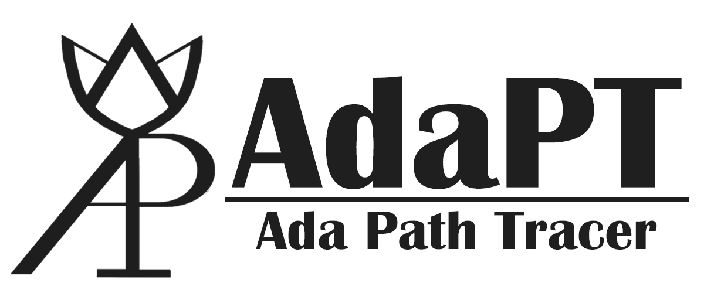

---

**Ada** **P**ath **T**racer is a simple Monte Carlo path tracing renderer based on [Taichi Lang](https://www.taichi-lang.org/), with which you can play easily. The name `AdaPT` is given by my GF and I think this name is brilliant. The icon (first version) is inspired by the *oracle bone script of Chinese character "光"*, which means 'Light'. 

This renderer is implemented based on **MY OWN** understanding of path tracing and other CG knowledge, therefore I **DO NOT** guarantee usability (also, I have done no verification experiments). The output results just... look decent:

|         "The cornell spheres"          |         "The cornell boxes"         |
| :------------------------------------: | :---------------------------------: |
|  |  |

Here are the features I currently implemented and supports:

- A direct component renderer: a interactive visualizer for direct illumination visualization
- A unidirectional Monte-Carlo MIS path tracer: supports as many bounce times as you wish, and the rendering process is based on Taichi Lang, therefore it can be very fast (not on the first run, the first run of a scene might take 30s to ?do some pre-processing and JIT compiling?). The figures displayed above can be rendered within 15-20s (with vulkan-backend, GPU supported). The rendering result is displayed incrementally, or maximum iteration number can be pre-set.
    - Global / indirect illumination & Ability to handle simple caustics
- BRDFs: `Lambertian`, `Modified Phong` (Lafortune and Willems 1994), `Frensel Blend` (Ashikhmin and Shirley 2002), `Blinn-Phong`, `Mirror-specular`.
- BSDFs (with medium): deterministic refractive (glass-like)
- mitusba-like XML scene file definition, supports mesh (from wavefront `.obj` file) and analytical sphere.
- Extremely easy to use, with detailed comments and a passionate maintainer (yes, I myself). Therefore you can play with it with almost no cost (like compiling, environment settings blahblahblah...)

BTW, I am just a starter in CG (ray-tracing stuffs) and Taichi Lang, so there WILL BE BUGS or some design that's not reasonable inside of my code. Also, I haven't review and done extensive profiling & optimization of the code, therefore again --- correctness is not guaranteed! But, feel free to send issue / pull-request to me if you are interested.

If you are indeed interested and you want to run a trial... try it yourself first and ask for help if you failed. I just think writing documents is a pain-in-the-ass...

For the commit logs, please refer to another repo: [Enigmatisms/learn_taichi](https://github.com/Enigmatisms/learn_taichi). This repo is isolated from my Taichi Lang learning repo.

---

AdaPT is licensed under GPL-v3.
