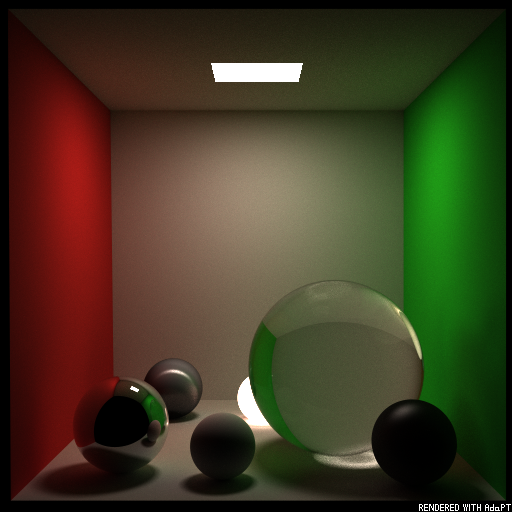
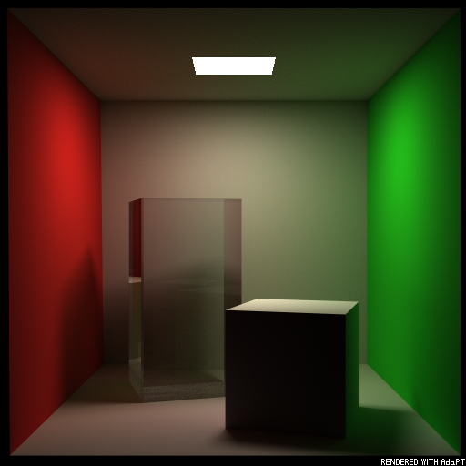

<p align="center"></p>

---

**Ada** **P**ath **T**racer is a simple Monte Carlo path tracing renderer based on [Taichi Lang](https://www.taichi-lang.org/), with which you can play easily. The name `AdaPT` is given by my GF and I think this name is brilliant. Currently, this renderer stops at version 1.5.x, since I think I should focus on something else until we have a better version of the backend (Taichi).

This renderer is implemented based on **MY OWN** understanding of path tracing and other CG knowledge, therefore I **DO NOT** guarantee usability. The output results look decent nevertheless:

##### Steady state rendering

For more example scenes, please refer to [Enigmatisms/AdaptiveGallery](https://github.com/Enigmatisms/AdaptiveGallery)

Sports car scene (~290k primitives, 16 bounces, with many different BxDFs):

<p align="center"></p>

Bathroom scene (~400k primitives, 8 bounces, source can be found [here]()):

<p align="center"></p>

Material orb scene (~500k primitives, 24 bounces, CUDA backend 16 fps):

<p align="center"></p>

Kitchen scene (100k+ primitives):

<p align="center"></p>

Stuff scene:

<p align="center"></p>

Bunny scenes are not uploaded in the repo (90k+ primitives).

| "Spotlight Foggy Bunnies" | "Three Bunnies" |
| ------------------------- | --------------- |
|              |                 |

|         "The cornell spheres"          |         "The cornell boxes"         | "Fresnel Blend" |
| :------------------------------------: | :---------------------------------: | :------------------------------------: |
|  |  | |


##### Console output

Powered by rich console. Note that the loading speed bottleneck (in the figure) no longer exists after [PR #19](https://github.com/Enigmatisms/AdaPT/pull/19) ! 


##### Transient state rendering

Note that the gifs presented here are made by compressed jpeg files and optimized (compressed gif). The actual number of images for making the gif is divided by 2, due to the large size of the resulting gif.

|         Transient balls (camera unwarped[^foot])          |         Transient cornell box (camera warped[^foot])         |
| :------------------------------------: | :---------------------------------: |
|||

[^foot]: 'Camera unwarped' means the transient profile shows the time when a position in the scene is *hit* by emitter ray. 'Camera warped' means the transient profile shows the total time of a position being hit by the emitter ray which should finally transmits to the camera.

Here are the features I currently implemented and support:

- A direct component renderer: a interactive visualizer for direct illumination visualization
- A **unidirectional / bidirectional Monte-Carlo MIS path tracer**: supports as many bounce times as you wish, and the rendering process is based on Taichi Lang, therefore it can be very fast (not on the first run, the first run of a scene might take a long time due to taichi function inlining, especially for BDPT). The figures displayed above can be rendered within 15-20s (with cuda-backend, GPU supported). The rendering result is displayed incrementally, or maximum iteration number can be pre-set.
- **Volumetric path tracer** that supports uni/bidirectional path tracing in both bounded and unbounded condition
- A **transient renderer** with which you can visualize the propagation of the global radiance.
- Texture packing and texture mapping, see `scenes/bunny.xml` for an configuration example. We support bump map / normal map / roughness map (this is not tested) for now.
- Shading normal is supported for a smooth appearance. 
- Rendering checkpointing and [rich](https://github.com/Textualize/rich) console pannel support. 
- Ray tracing accelerating structure, for now, we only support `BVH`. `KD-tree` will be implemented in the future.
- Global / indirect illumination & Ability to handle simple caustics
- BRDFs: `Lambertian`, `Modified Phong` (Lafortune and Willems 1994), `Fresnel Blend` (Ashikhmin and Shirley 2002), `Blinn-Phong`, `Mirror-specular`.
- BSDFs (with medium): deterministic refractive (glass-like)
- mitusba-like XML scene file definition, supports mesh (from wavefront `.obj` file) and analytical sphere.
- scene visualizer: which visualizes the scene you are going to render, helping to set some parameters like the relative position and camera pose
- Extremely easy to use and multi-platform / backend (thanks to Taichi), with detailed comments and a passionate maintainer (yes, I myself). Therefore you can play with it with almost no cost (like compiling, environment settings blahblahblah...)

BTW, I am just a starter in CG (ray-tracing stuffs) and Taichi Lang, so there WILL BE BUGS or some design that's not reasonable inside of my code. Also, I haven't review and done extensive profiling & optimization of the code, therefore again --- correctness is not guaranteed **(yet the steady state rendering results are compared with mitsuba(0.6) and pbrt-v3)**! But, feel free to send issue / pull-request to me if you are interested.

## [](https://repography.com) / Recent activity [](https://repography.com)

[](https://github.com/Enigmatisms/AdaPT/commits)
[](https://github.com/Enigmatisms/AdaPT/issues)
[](https://github.com/Enigmatisms/AdaPT/pulls)
[](https://github.com/Enigmatisms/AdaPT/graphs/contributors)

---

### Rendering Example

​To run the rendering, use:

```shell
# For bidirectional path tracer
# Make sure you are in root folder.
# pip install -r requirements.txt			# Dependencies should be satisfied
python3 ./render.py --scene cbox --name cbox.xml --iter_num 8000 --arch cuda --type bdpt
# For volumetric path tracer: --type vpt, for vanilla path tracer: --type pt
```

#### useful parameters

- `--scene`: in the folder `scenes/`, it specifies the folder to load from.
- `--name`: in the specified folder, for example: `./scenes/cbox/`, we choose one scene `xml` file to render.
- `--iter_num`: number of iterations for rendering. Note that my implementation is not tile-based, therefore you can stop rendering any time you want (using `esc`, or closing the window. Do not use `ctrl+c`)
- `--arch`: `cuda / gpu / cpu / vulkan`  is supported (Taichi lang feature)
- `--type`: `bdpt` for bidirectional path tracing, `vpt` for volumetric path tracing, `pt` for path tracing
- `--save_iter`: Iteration milestones for saving rendering checkpoints (as `.pkl` file), you can load from it later.
- `-l`: load from the check point. For more configurations for checkpointing, please see `parsers/opts.py`.
- `--img_ext`: extension for output images: support `['jpg', 'png', 'bmp']`
- `--no_cache`: Disable Taichi JIT caching (to save disk space), by default we will enable caching, since BDPT is a complicated renderer and due to the auto-inlining of Taichi functions, JIT is slow (50s-1min, machine-dependent)
- `--no_gui`: For simpler renderer and simpler scenes (without too many primitives and path bounces), disable the interactive GUI and accelerate rendering.
- `--normalize`: For some scenes and some particular emitter configurations, the rendering result can be very dark. Using for example `--normalize 0.99` can normalize the resulting image with 0.99 quantile number of the image.

Note that some scene has default ray-intersection accelerator, like `scene/bunny.xml`. If you are using Linux, `BVH` support can be easily turned on, but make sure you have `eigen3` installed in `/usr/include/eigen3`, running:

```shell
cd tracer/
python3 ./setup.py install --user
```

BVH module will be compile to dyn-lib, therefore we can import the BVH module and use this accelerator.

If you want to configure your own scene, you can use the simple scene visualizer (without texture / shading) `scene_viz.py`:

```shell
python3 ./scene_viz.py --scene cbox --name cbox.xml
```

Using interactive UI to configure the camera extrinsics / intrinsics and object placement. 

---

AdaPT is licensed under GPL-v3. Copyright @Qianyue He.
